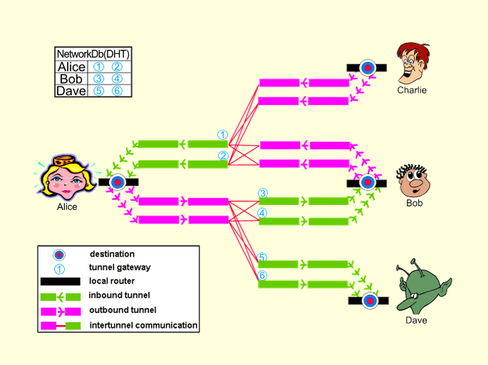

\newpage

# Introducción: La Seguridad en la Red

La seguridad en la red. Como bien todos sabemos en la red se mueve un
volumen de datos abrumador. Datos que, en malas manos, pueden suponer
daños para tanto los dueños de esos datos como sus
destinatarios. Desde “inocentes” “me gusta” en cualquier red social
hasta una compra online con nuestra tarjeta de crédito.

A muy poca gente parece que le importe publicar que le guste un vídeo
de gatitos, o que te gusten las camisetas que un amigo tuyo se ha
comprado por internet. Pero seguro que existe alguna tienda de ropa
que estará interesada en anunciarte camisetas con dibujos de gatitos.

Esto parece ser inofensivo. ¿En qué me puede perjudicar esto? Sólo me
está facilitando las cosas y poniéndome anuncios que me interesan. No
quiero que me salgan anuncios de robots de cocina o del último disco
del artista de turno. Enhorabuena, creo que has llegado al final de
las ventajas de que tus datos sean publicados abiertamente. Porque son
ventajas... ¿no?

Dejándonos de reflexiones filosóficas sobre que nos controlan y
manipulan y dicen qué tenemos que comprar y ser, que eso es ya un tema
que viene al caso, pero no es el momento, analizaremos otros aspectos
que pueden llegar a ser bastante perjudiciales.

Lo primero que se nos viene a la cabeza es que nos roben nuestra
contraseña del banco, nos timen con una compra y se queden con los
datos de nuestra tarjeta... pero todos estos fallos son fallos de
seguridad que todo el mundo somos capaces de ver y sobre todo de
percibir su peligro.

Entonces, ¿qué factores no percibimos?

Volvamos al caso anterior de los gatitos y las tiendas de
camisetas. Cambiemos el “me gusta en fotos de gatitos” por una búsqueda
en Google de “qué hacer si te duele el pecho al hacer ejercicio” y
“una tienda de camisetas” por “la aseguradora que tendrás de aquí a 20
o 30 años”. Ahora la cosa cambia bastante. Lo que antes implicaba un
bonito anuncio ahora implica una indeseable subida en la cuota de la
aseguradora de 300€ extra al mes. Puede que esos 3600€ al final del
año puedan servirte para tener unas buenas vacaciones, o para pagar
los estudios de tus hijos. En el peor de los casos, puede que no
puedas permitirte esa cantidad de dinero y que nunca puedas recibir un
tratamiento adecuado en igualdad de condiciones.

Igual este ejemplo es un poco dramático, y las cifras puedan ser
exageradas. Pero... `¿alguien es capaz de compartir un ejemplo que
refleje la importancia de la privacidad en la red?`
<!-- Se pregunta a la audiencia -->

Entonces, una vez hemos pensado en esto igual nos empezamos a plantear
la importancia de la privacidad en la red. Pero de nuevo... 
`¿qué opciones tenemos para evitar esto?`

Podemos empezar con pequeños cambios. Sustituir por ejemplo buscadores
como Google por otros que no te rastreen y almacenen tus datos, como
DuckDuckGo. Incluso hablando de rastrear, podemos sustituir Google
Maps, que realiza una cronología de tu ubicación para situarte en cada
momento desde el momento en el que conseguiste tu móvil por otros
mapas como Open Street Map, que además por ser software libre puede
contribuirse a que cada día esté mejor documentado. O Google Street
View por Mapillary. Como podemos ver Google es un recopilador de datos
por defecto, pero no es el único, también es una buena consideración
sustituir Instagram y Facebook por otras redes sociales, como
Mastodon.

Pero como es comprensible, es muy difícil desligarse de todas estas
compañías y no quedarse “aislado” en el mundo. Por esto, hay que ir
poquito a poco y con buena voluntad.


Otras opciones “más drásticas” o “menos usuales” consisten en hacer uso
de herramientas de privacidad que implementan medidas extra de
seguridad. Tal vez la más popular de ellas y la que sólo vamos a
mencionar levemente sea TOR. Sin embargo, nos centraremos más en I2P,
el Proyecto de Internet Invisible.

# TOR

La red Tor, a grandes rasgos, es un grupo de servidores controlados
por voluntarios del proyecto que permiten mejorar la privacidad y la
seguridad de sus usuarios en Internet. Usan diversos “túneles
virtuales” en lugar de conexiones directas y así pueden compartir
información en redes públicas sin comprometer su privacidad.

Tanto Tor como I2P son redes de proxies anónimas, que permiten a los
usuarios salir anónimamente a través de su red. Aun así guardan
ciertas diferencias. El modelo de amenazas y el diseño de los
outproxies son distintos. También Tor usa un enfoque basado en
directorios mientras que I2P tiene una base de datos de la red
distribuida de la cual se seleccionan los pares. Y sobre todo, para
aquellos que estén más familiarizados con Tor, la terminología que
tienen ambos para referirse a ambas cosas difiere (celda-mensaje,
circuito-tunel, nodo de entrada/salida-inproxy/outproxy...)

El proxy de salida de I2P/Tor tienen a pesar de todo algunas
vulnerabilidades frente a ataques de análisis una vez la comunicación
deja la red Tor.

## Ventajas de Tor sobre I2P

Tor está mucho más extendido, tiene una comunidad mayor, con todo lo
que ello implica a nivel de documentación, traducción, etc. y han sido
capaces de dar soporte a problemas de escalado que I2P todavía
no. Bloquea ataques DOS, los nodos cliente consumen muy poco ancho de
banda, tiene un contro centralizado que permite reducir la complejidad
de cada nodo. Tiene mejor uso de la memoria y está programado en C (no
en java). 


## Ventajas de I2P sobre Tor

Está diseñado para garantizar los servicios ocultos mucho más rápido
que Tor. Está totalmente distribuido. Los pares son continuamente
elegidos en función de su rendimiento y categoría, en lugar de confiar
en su capacidad indicada. Es tan pequeña que no ha intentado ser
atacada con DOS. Los túneles I2P tienen una vida tan corta, lo cual
dificulta las muestras que un atacante puede tomar.
<!-- Insertar foto de Mr.Meeseek -->
Permite tanto UDP como TCP. Además se están trabajando en otras
medidas de seguridad contra ataques de análisis, tales como envolver
múltiples mensajes para evitar el conteo, o introduciendo demoras en
saltos donde las demoras no son perceptibles o incluso estableciendo
túneles de tamaño fijo que completarían con relleno si no se alcanzase
dicho tamaño.

# Otra alternativa. Freenet

Freenet es una red completamente distribuida y anónima de publicación
par a par. Esta ofrece una forma segura de almacenar datos y está
enfocada a solucionar problemas de carga y desbordamientos. Pero
mientras que Freenet está diseñada como un almacén distribuido de
datos, sus usuarios han construido aplicaciones sobre el sistema para
tener comunicaciones anónimas genéricas.

Este diseño de almacén hace que se pueda usar para acceder al
contenido publicado por otros incluso sin que estos otros estén
online. Esta funcionalidad I2P nunca la tendrá. Por esto a día de hoy
no se puede usar I2P como sistema de almacenamiento distrubuido.

Freenet presenta algunos problemas de implementación, escalabilidad e
incluso hay problemas con el anonimato de algunos algoritmos dada la
heurística de ruteo de Freenet. Sin embargo sus propiedades desalentan
a cualquier atacante que no tenga recursos suficientes para realizar
análisis completos.

# Invisible Internet Project. I2P

Ahora que tenemos un ligero conocimiento sobre cómo funcionan algunas
de las otras redes anónimas más usadas, vamos a realizar un análisis
algo más profundo de I2P.

En pocas palabras, I2P es un proyecto para construir, desplegar y
mantener una red que soporte comunicación segura y anónima. Es
administrable en cuanto a anonimato, fiabilidad, uso de banda ancha y
latencia. Ninguno de estos puntos es presionable para comprometer la
seguridad del sistema. De hecho es configurable dinámicamente en
función de los ataques que pueda recibir.

La mayoría de las redes anónimas pretenden ocultar al autor original
de una comunicación, pero no al destinatario. I2P, por el contrario,
está diseñado para permitir la comunicación anónima entre dos pares
que no son identificables entre ellos y entre terceras partes. Ahora
mismo hay tanto sitios web internos que permiten publicación y
hospedaje anónimo como proxies HTTP hacia la web normal que permiten
la navegación anónima.

La red está orientada a mensajes, y es, en esencia, una capa IP segura
y anónima donde los mensajes son direccionados hacia claves
criptográficas y estos pueden ser más largos que los paquetes IP.

El diseño de I2P busca hacer más costosa la identificación de un
individuo en un ambiente hostil, cubriendo su tráfico con el de otras
personas que no requieran tal anonimato.

## ¿Cómo lo hace?

La red se compone de una instalación de nodos, llamados routers, con un
número de rutas virtuales unidireccionales entrantes y salientes,
llamados túneles. Cada router tiene una identidad cifrada que suele
ser permanente. Estos routers se comunican entre ellos con UDP o
TCP. La diferencia radica en que un cliente puede conectarse
a cualquier router y autorizar la creación temporal de túneles para
la comunicación a través de la red.

I2P tiene su propia base de datos de red para distribuir la
información de rutas y contactos, igual que hacía Kademlia. De
hecho implementa una modificación de su algoritmo.

<!--Imagen Comunicación Alice,Bob,Charlie,Dave-->


En esta foto observamos el esquema de una posible comunicación en
I2P. Si Alice quiere hablar con Bob, envía un mensaje por su tunel de
salida a algún tunel de entrada de Bob, sabe cómo enviarlos
consultando la base de datos de la red, que es continuamente
actualizada.

Bob, para responderle simplemente tiene que repetir el mismo
proceso. Envía un mensaje al tunel de entrada de Alice. Para hacer las
cosas más sencillas, se usa la envoltura garlic, una encriptación por
capas, incluyendo la información necesaria para que Alice pueda
responder sin tener que consultar la base de datos.

Respecto a las medidas de seguridad de I2P, como mencionábamos antes,
es completamente distribuida, sin servidores que tengan estadísticas
de uso ni control centralizado. Además, hace uso de un gram número de
técnicas criptográficas, algoritmos de encriptación tales como cifrado
Gamal de 2048 bits, AES de 256 bits, hashes SHA256...


## Envoltura garlic

A diferencia de la red Tor, que emplea el enrutado Onion, I2P utiliza
la envoltura garlic. 

Ambas son bastante similares, por ejemplo, en cuanto a su cifrado por
capas. Sin embargo, en el caso de la envoltura garlic, se extiende el
concepto del enrutado onion, puesto que podemos agrupar varios
mensajes juntos (dientes de ajo). Dichos mensajes se exponen en el
último ruter del túnel correspondiente. 

Otra diferencia que podría relacionarse con el cambio de nombre sería
el camino unidireccional del "garlic routing", lo cual simplifica el
algoritmo. 

## Base de datos

La base de datos o netDb de I2P contiene 2 tipos de datos: la
información de contacto del ruter (RouterInfo) y la destinación
(LeaseSet). 

La netDb usa una técnica conocida como "FloodFill", que consiste en
una serie de ruters que mantienen la base de datos distribuida.

Además, los datos están verificados correctamente y su información va
cambiando, reemplazando entradas antiguas y protegiéndose frente a
ciertos ataques.


## Terminología de los túneles

<!--Conceptos de los túneles-->


En este ejemplo, Alice envía un mensaje a Bob. De este modo y tal como
hemos visto anteriormente, se construyen túneles virtuales. En el
ejemplo de comunicación previo, hemos distinguido entre túneles de
salida (los empleados por Alice) y túneles de entrada (los usados por
Bob). Sin embargo, podemos diferenciar otras tres categorías a la hora
de clasificar los túneles.

- Túnel puerta de salida o gateway: el primer ruter en un túnel. En
  este caso, serían la A y D de nuestra imagen.
  
- Túnel punto final o endpoint: el último ruter del túnel (C y F en el
  ejemplo).
  
- Túnel participante: los ruters que no son gateways o endpoints. Es
  decir, las letras B y E de arriba.
  

También podemos considerar los túneles en función del número de saltos
entre los ruters. Así, en un túnel de 0 saltos, coincidirían el
gateway y el endpoint, mientras que en uno de 2 saltos habría un túnel
participante entre ambos.


## Selección de pares

Este proceso consiste en elegir a través de qué routers queremos
enviar nuestros mensajes. Para ello, se analizan los perfiles de los
pares, que recogen datos que nos indican su velocidad, sobrecarga,
capacidad de aceptar nuestras peticiones...

La selección se realiza constantemente, dada la gran cantidad de
túneles clientes que puede mantener el router. Además, la vida de un
túnel tan solo dura unos diez minutos. De este modo, el profiling o
creación de los perfiles de los pares resulta de gran utilidad.


## Pila de protocolos de I2P

Para explicar la funcionalidad de I2P, podemos distinguir las capas en
las que puede dividirse.


- Capa de Internet: emplea el protocolo IP, de Internet, que hace uso
  de la entrega de mejor-esfuerzo (best-effort) para aceptar y enviar
  paquetes.
  

- Capa de transporte: garantiza la llegada de los paquetes en
  secuencia y sin errores. Utiliza los protocolos TCP (fiable y
  ordenado) y UDP (no fiable y desordenado).
  

- Capa de transporte I2P: suministra conexiones cifradas entre 2
  routers I2P. No obstante, aún no son anónimos.
  
Para ello se implementan los protocolos NTCP, construido encima de
TCP, y SSU (UDP Seguro Semi-fiable), que usa UDP.


- Capa de túnel I2P: suministra conexiones entre túneles con cifrado
  completo. Transmite mensajes de túnel, que contienen mensajes
  cifrados I2NP (envían mensajes a múltiples routers).
  
- Capa Garlic de I2P: permite la entrega de mensajes I2P cifrada y
  anónima de extremo a extremo. Los mensajes I2NP se envuelven unos en
  otros, asegurando el cifrado entre los túneles y transmitiéndose del
  origen al destino anónimamente para ambos.
  
A continuación, podemos hablar de otras capas importantes que
constituyen I2P aunque no forman parte de su funcionalidad central. 

- Capa de cliente I2P: permite el uso de las funcionalidades de I2P
  sin tener que acceder a la API del router. Utiliza el protocolo
  I2CP. 

- Capa de transporte extremo a extremo: posibilita funcionalidades del
  tipo TCP y UDP encima de I2P. Contiene una librería de Streaming
  (streams TCP) y una librería de datagramas (UDP). 

- Capa de interfaz para aplicaciones I2P: librerías que facilitan
  implementaciones sobre I2P (I2PTunnel o BOB). 

- Capa proxy para las aplicaciones I2P: constituida por sistemas
  proxy, tales como el servidor/cliente HTTP. 

- Capa de aplicación de I2P: está conformada por una gran cantidad de
  aplicaciones sobre I2P (correo, navegadores, aplicaciones de
  streaming/datagramas...). 

En el siguiente esquema podemos ver reflejada la división en capas que
acabamos de describir. 

<!--Imagen Capas I2P-->


\newpage
# Conclusiones

Como hemos podido comprobar, existen alternativas que podemos emplear
para proteger nuestra privacidad en el ámbito de la red. 

La seguridad y privacidad en la red no es ninguna banalidad. Si no nos
preocupamos nosotros cuanto antes, serán otros los que se beneficiarán
a nuestra costa. Pequeños cambios pueden llegar a suponer grandes
beneficios.

A pesar de que las redes anónimas también tienen sus propias
vulnerabilidades y puntos que deben ser desarrollados para un mejor
funcionamiento, pues bien es sabido que alguien con suficientes
medios, como la NSA, puede identificar al usuario medio como
cualquiera de nosotros, pero contra muchas otros riesgos a los que
estamos expuestos, nos ofrecen un camino más seguro con el que sentirnos
menos comprometidos. 

I2P es una red muy versátil que nos permite acceder a una gran
cantidad de aplicaciones tales como blogs, foros, correo electrónico,
chat en tiempo real, navegación web, clientes de mensajería
instantánea... 

Además, el balance es muy positivo cuando consideramos que se trata de
un proyecto de código abierto en el que cualquiera puede contribuir. 

\newpage
# Instrucciones de instalación

Para los más atrevidos, dejaremos unas instrucciones de
instalación. En nuestro caso, para una distribución basada en debian
como es Ubuntu.

## Desde línea de comandos
1. Añadimos los repositorios.

` sudo apt-add-repository ppa:i2p-maintainers/i2p `

2. Actualizamos e instalamos.

```
sudo apt-get update
sudo apt-get install i2p
```

## Usando Synaptic
1. Añadimos los paquetes personales de archivos con Synaptic: En el
   apartado configuración seleccionamos *“Repositorios”*. 
   
2. En la ventana que nos aparece, accedemos a *“Otro Software”* y añadimos
   “ppa:i2p-maintainers/i2p” en la "Línea apt" que nos aparece al
   hacer click en Añadir. 
   
3. Pulsamos en añadir origen. 
   
4. Abandonamos esta ventana y recargamos los repositorios.
   
5. En el filtro buscamos “i2p”, click derecho sobre “i2p” y luego
   “marcar para instalar”. 

6. Click en “Aplicar”


Ahora para lanzar un router i2p simplemente hay que escribir en la
terminal. **Importante nunca ejecutar este comando como super
usuario**.


`i2prouter start`

Ahora podemos configurar la NAT/firewall, el port forwarding,
accediendo desde el navegador a http://127.0.0.1:7657/confignet. Para
esta demostración no vamos a modificar esto.

Los ajustes del ancho de banda se pueden configurar en esa misma
página. Esto sí que es recomendable configurarlo si se desea una
velocidad potencial mayor.

Para acceder a los sitios .i2p en nuestro navegador debemos configurar
el proxy. En nuestro caso, Firefox, la configuración es la siguiente. En
Menú-Preferencias-General-Proxy de Red-Configuración debemos
configurar lo siguiente:


Para probar que todo esté bien, se puede intentar conectar a la [wiki
de i2p](i2pwiki.i2p)

# Fuentes

Las fuentes de esta exposición son las siguientes:

* [**¿Qué es TOR?** https://www.torproject.org/about/overview.html.en](https://www.torproject.org/about/overview.html.en)
* [**Comparación TOR-I2P**: https://geti2p.net/es/comparison/tor](https://geti2p.net/es/comparison/tor)
* [**Comparación Freenet-I2P**: https://geti2p.net/es/comparison/freenet ](https://geti2p.net/es/comparison/freenet)
*
  [**Introducción y tutorial a I2P**: https://thetinhat.com/tutorials/darknets/i2p.html](https://thetinhat.com/tutorials/darknets/i2p.html)
  
* [**Guía Port-Forward (no modificado en la demo)**: portforward.com](portforward.com)

* [**Configurar Proxies**: https://geti2p.net/en/about/browser-config](https://geti2p.net/en/about/browser-config)
